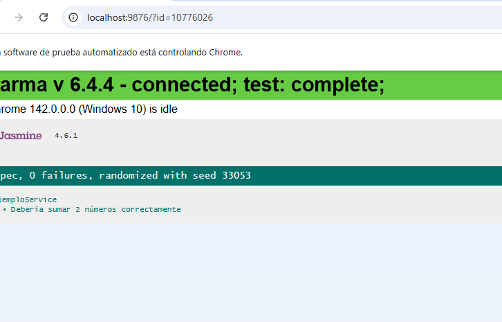
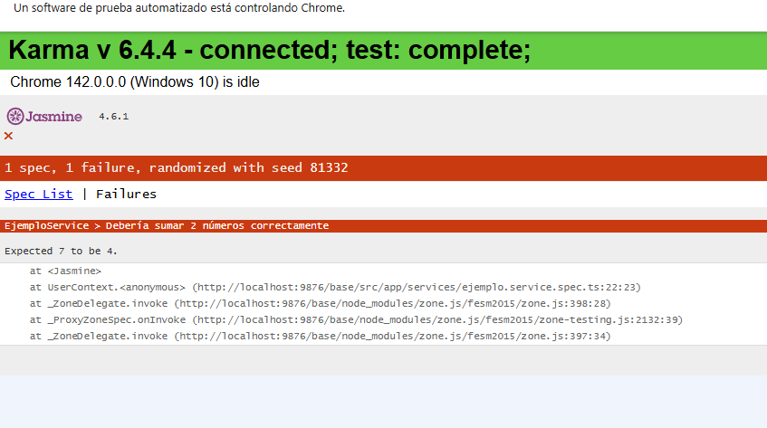
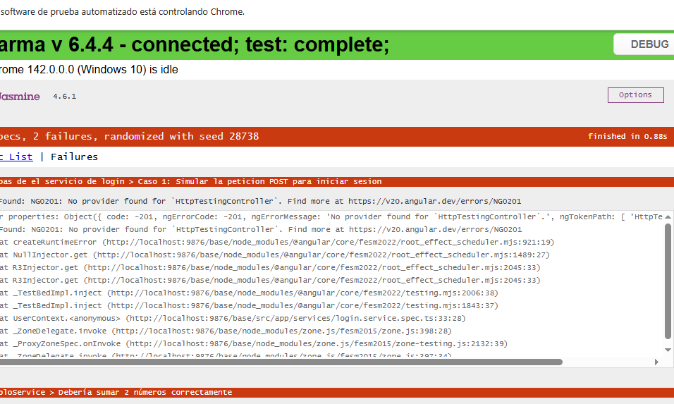
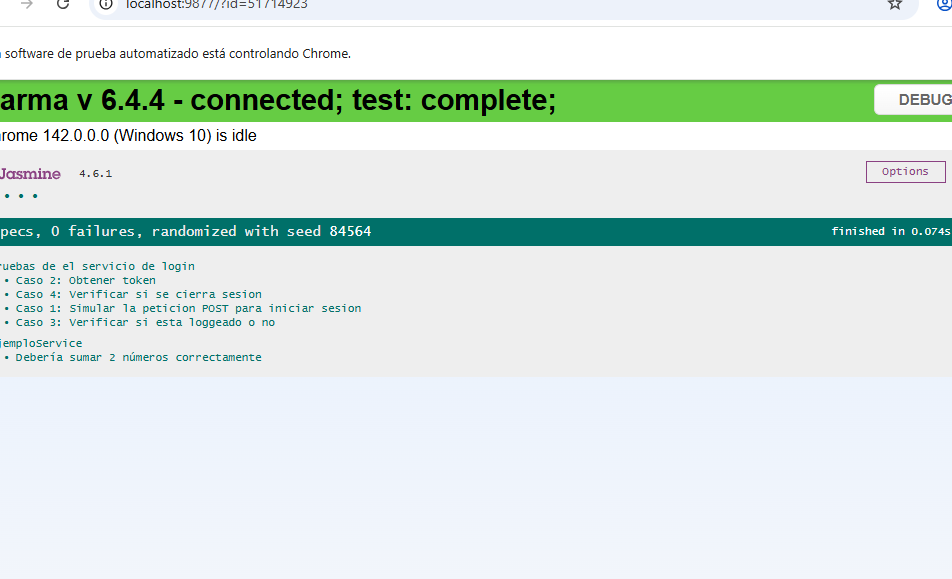

# FrontEndPruebaTecnica_BIT-_202506
Este repositorio presenta la solución de una prueba técnica realizada en clase, diseñada para ayudar a los estudiantes a aprender y practicar el uso de Jasmine y Karma en aplicaciones de Angular +17


# Solución Prueba Técnica - Uso de Jasmin y Karma en Angular +17

---

## Objetivo del Repositorio 
- Reforzar los conocimientos adquiridos sobre desarrollo de aplicaciones Front-End con Angular.
- Proporcionar una guía práctica para implementar pruebas unitarias con **Jasmine**.  
- Enseñar el uso de **Karma** para realizar pruebas en el navegador.  
- Fomentar buenas prácticas en el desarrollo de aplicaciones robustas y testeables en Angular. 

## Contenido  
- 📂 Estructura del Proyecto: Código de ejemplo organizado y modularizado para facilitar el aprendizaje.
- 🛠️ Configuración de Jasmine y Karma: Incluye los archivos de configuración para empezar a trabajar con Jasmine y Karma rápidamente.
- 🧪 Pruebas Unitarias en Angular: Ejemplos de cómo probar servicios en Angular.

---

## Prueba Técnica  
### Descripción  
| Área                  | Requisitos                                                                                   |
|-----------------------|---------------------------------------------------------------------------------------------|
| **Backend en Node.js**| - Implementar una API RESTful para operaciones CRUD en la colección "Users".<br>- Crear un servicio en el mismo controlador de "Users" para iniciar sesión autenticado por **JsonWebToken**. |
| **Base de Datos**     | - Utilizar **MongoDB** para almacenar a los usuarios.                                       |
| **Frontend en Angular**| - Crear una interfaz de usuario que permita registrar usuarios.<br>- Crear una interfaz que permita iniciar sesión a un usuario ya registrado. |

---

## Cómo Utilizar Este Repositorio  
### Requisitos Previos  
- Node.js v18+  
- Angular CLI para trabajar con el proyecto Angular.

### Paso a Paso  
1. Clona el repositorio:  
   ```bash
   git clone https://github.com/LuisaCastano40/FrontEndPruebaTecnica_BIT-_202407.git
2. Instala las dependencias necesarias: 
    ```bash
    npm install
3. Si es necesario, realiza la configuración de tu entorno, como variables de entorno o configuraciones adicionales para el servicio o la base de datos (Necesitas un backend para probar funcionamiento del frontend).    
4. Ejecuta el servidor:
    ```bash
    ng serve
5. Corre las pruebas unitarias:
    ```bash
    ng test

---

## Autoría  
Este proyecto fue desarrollado como material educativo para estudiantes de BIT +. Si tienes preguntas o sugerencias, no dudes en contactarme.  

- **Autor:** Esperanza carvajal torres
- **GitHub:** [Esperanza carvajal](https://github.com/fullstack2025771/taller2.)  
- **LinkedIn:** [Perfil de linkedIn](https://www.linkedin.com/in/esperanza-carvajal-torres-a35aa0355/) 

## Taller 2.
1. Se instala las dependencias que faltan con npm i,
2. ng serve
3. Se cambia la Ip por local host:9000
4. Se trabaja con el servicio de Inicio se sesion y con el de Ejemplo 
5. En login.service.ts se observa una logica muy parecida a la que se venia trabajando en el proyecto anterior.
6. Hay cuatro metodos para verificar el inicio de sesion o autenticacion .
7. Creamos el servicio Login.service.spect.ts ES para ejecutar las pruebas y probar, configuramos para simular  el cliente Http y providedHttpClient y el providedHttpClientTesting
8. como siempre se configura el entorno de pruebe  
9. Se definen grupos de pruebas con describe
10 Se tiene el beforeEach el cual nos habre el entorno de pruebas
11. Con  el comando ng test se abre de forma automatica se abre el navegador Karma y queda listo para ejecutar las pruebas en CHROME
13. Definimos los casos individuales de prueba
14. Definimos los grupos de pruebas con describe y los Mock para simular es decir falsa que nos sirva como ejemplo para hacer peticiones a una Api, y se coloca la configuracion inicial del entorno de pruebas.
despues definimos los casos de pruebas
15.Definimos funciones con credenciales y token con simulacion
Utilizamos el metodo beforeEach Ante , se le dan los Providers.
16.Definimos los casos de prueba por cada uno de los metodos en cuestion.
simulamos la peticion POST para iniciar sesion, verificamos que la ruta sea correcta.
17. Probamos el metodo login con credenciales falsas, para que nos de error.
18.simulamos respuestas falsas y ejecutamos el proceso 
18.Simulamos la peticionn al backend esperando que sea igual a la url dada.
19. Obtenemos el token 
entramos al localStorage con expect y toBe
verificamos si esta logueado o no con isLoggedIn y el inicio de sesion con setItem se cierra sesion se valida el token y debe retornar ToBeNull


Imagenes
1.Abrir Karma

2.Fallo Ejemplo

3. Error en Inicio de sesion

3..Funciono 

